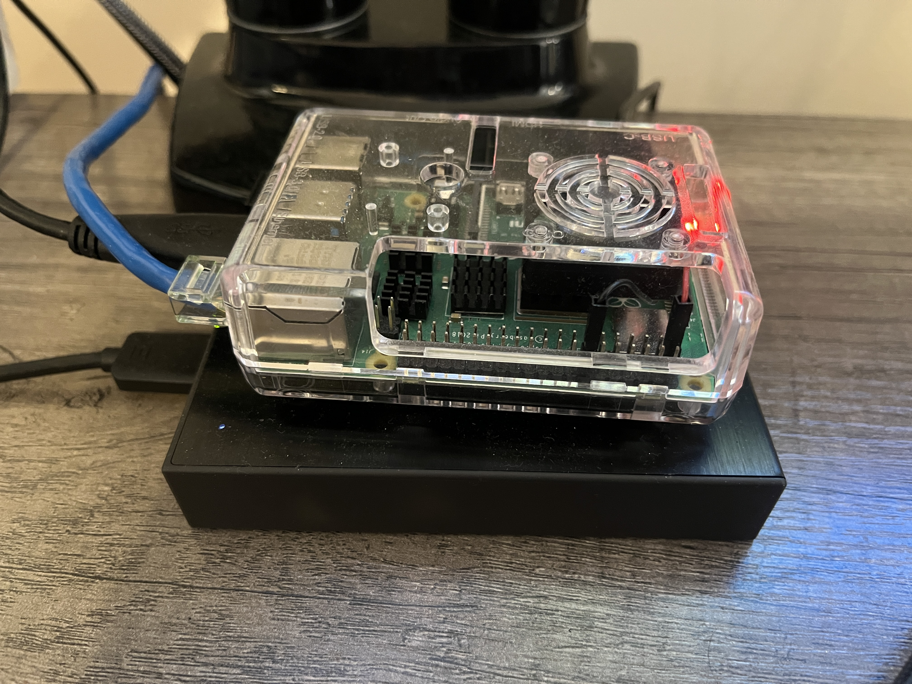

# Home NAS and VPN
A repository to hold information pertaining to a homemade Network Attached Storage (NAS) and Virtual Private Network (VPN) solution for easy remote file access.

The materials used to accomplish this project are:
<ul>
  <li>1 Raspberry Pi</li>
  <li>1 Large USB storage Device</li>
  <li>1 Wireless Router</li>
</ul>

The frameworks/codebases used for this project are:
<ul>
  <li>PIVPN - https://pivpn.io</li>
  <li>Wireguard - https://www.wireguard.com</li>
  <li>OpenMediaVault - https://www.openmediavault.org</li>
</ul>

I was able to follow the instructions on this repo, https://github.com/OpenMediaVault-Plugin-Developers/installScript. This allowed me
to install OpenMediaVault on the Pi.

```sudo wget -O - https://github.com/OpenMediaVault-Plugin-Developers/installScript/raw/master/install | sudo bash```

The method that I used to create this project's VPN was by using PiVPN, https://pivpn.io/#install. This will install and automatically configure WireGuard for my Raspberry Pi.
Also if you are following this project, you would need to add a user profile for wireguard using the "pivpn add" command.

```curl -L https://install.pivpn.io | bash```

Finally, by adding the correct IP address on my wireless router for both port forwarding and for IP reservation, the WireGuard VPN and NAS systems were working.
I've tested this project, and it works on Linux, iOS, MacOS, Windows, and Android.

The completion of this project has allowed me to use a configurable, secure, and easily accessible storage solution.




Also in terms of maintaining this system, the only issues that I've had required an operating system upgrade for the Pi.
If you get an error where the device doesn't seem to be producing an IP address on the router, it may need a re-image to keep an up to date OS on the Pi.
No Data was lost when re-imaging the device, and re-installing the software.

Current OS: Debian GNU/Linux 12 (bookworm) aarch64
